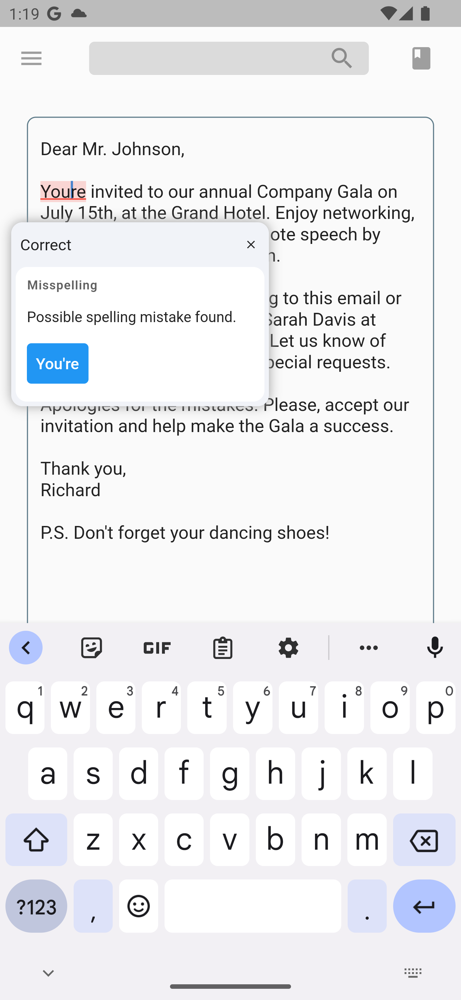
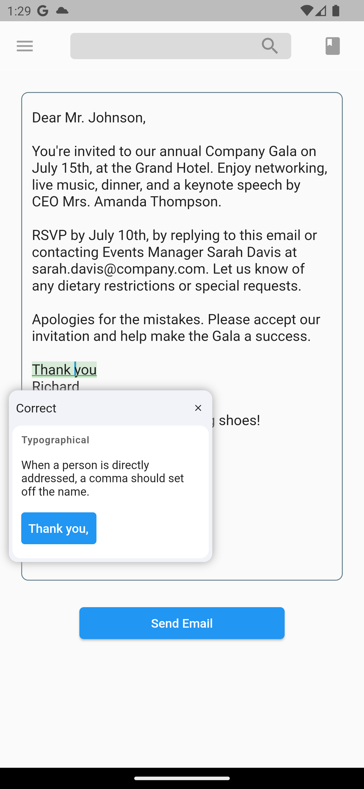
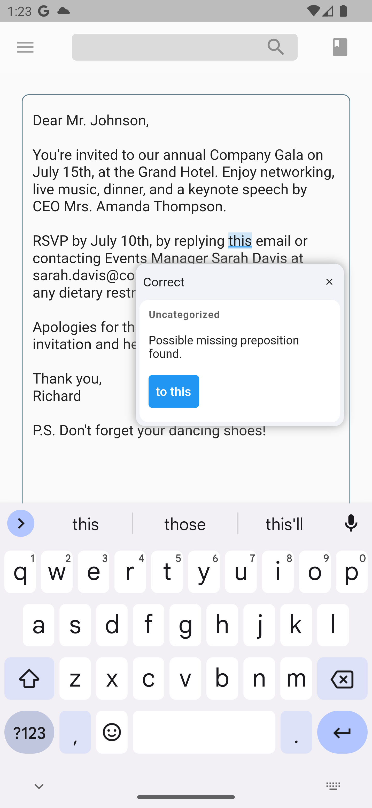

<!--
This README describes the package. If you publish this package to pub.dev,
this README's contents appear on the landing page for your package.

For information about how to write a good package README, see the guide for
[writing package pages](https://dart.dev/guides/libraries/writing-package-pages).

For general information about developing packages, see the Dart guide for
[creating packages](https://dart.dev/guides/libraries/create-library-packages)
and the Flutter guide for
[developing packages and plugins](https://flutter.dev/developing-packages).
-->

# LanguageTool TextField

Providing powerful spell-checking and grammar correction capabilities.

<div>

&nbsp
&nbsp

&nbsp
&nbsp

</div>

## Features

The LanguageTool TextField package is a spell-checker designed for Flutter apps. It integrates with the LanguageTool API to offer real-time spell-checking capabilities. This package will enhance text input accuracy by automatically detecting and highlighting spelling errors as users type. 

It's particularly useful for apps that require precise text input, like chat or note-taking apps. By using the LanguageTool TextField package, developers can improve the user experience by providing an intuitive and reliable spell-checking feature.


## Getting started

1. Add dependency:

```dart
flutter pub add language_tool_textfield
```

2. Import the package:

```dart
import 'package:language_tool_textfield/language_tool_textfield.dart';
```


## Quick Start
To start using the plugin, copy this code or follow the example project in 'languagetool_textfield/example'

```dart
// Create a base API client
final _languageTool = LanguageToolClient();

// Add input debouncing
final _debouncedLangService = DebounceLangToolService(
  LangToolService(_languageTool),
  const Duration(milliseconds: 500),
);

// Create a text controller for the Widget
final _controller = ColoredTextEditingController(
    languageCheckService: _debouncedLangService
);

// Use the text field widget in your layout
child: LanguageToolTextField(
  style: const TextStyle(),
  decoration: const InputDecoration(),
  coloredController: _controller,
  mistakePopup: MistakePopup(popupRenderer: PopupOverlayRenderer()),
);

// Don't forget to dispose the controller
_controller.dispose();
```

## Legal

This is an unofficial plugin. We are not affiliated with LanguageTool.
All logos are of their respected owners.

## Current issues

Current issues list [is here](https://github.com/solid-software/languagetool_textfield/issues).\
Found a bug? [Open the issue](https://github.com/solid-software/languagetool_textfield/issues/new).

