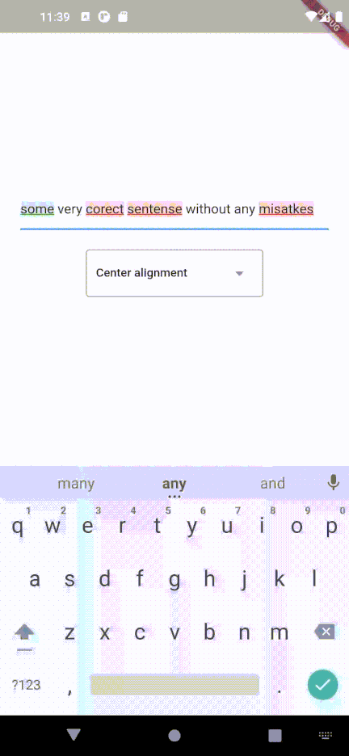

<!--
This README describes the package. If you publish this package to pub.dev,
this README's contents appear on the landing page for your package.

For information about how to write a good package README, see the guide for
[writing package pages](https://dart.dev/guides/libraries/writing-package-pages).

For general information about developing packages, see the Dart guide for
[creating packages](https://dart.dev/guides/libraries/create-library-packages)
and the Flutter guide for
[developing packages and plugins](https://flutter.dev/developing-packages).
-->

# LanguageTool TextField

Providing powerful spell checking and grammar correction capabilities.

## Features

The LanguageTool TextField package is a spell-checker designed for Flutter apps. It integrates with the LanguageTool API to offer real-time spell-checking capabilities. This package will enhance text input accuracy by automatically detecting and highlighting spelling errors as users type. 

It's particularly useful for apps that require precise text input, like chat or note-taking apps. By using the LanguageTool TextField package, developers can improve the user experience by providing an intuitive and reliable spell-checking feature.


## Getting started

1. Open your Flutter project in your preferred code editor.

2. Open the ```pubspec.yaml``` file in your project's root directory.

3. Add the following line under the dependencies section:

```dart
language_tool_textfield: latest
```

4. Save the pubspec.yaml file to fetch the package.

5. In your terminal or command prompt, navigate to your project's root directory.

6. Run the following command to fetch the package:

```dart
flutter pub get
```

7. Import the package in your Dart code file:

```dart
import 'package:language_tool_textfield/language_tool_textfield.dart';
```


## Quick Start

```dart
import 'package:flutter/material.dart';
import 'package:languagetool_textfield/languagetool_textfield.dart';

/// Example App main page
class App extends StatefulWidget {
  /// Example app constructor
  const App({super.key});

  @override
  State<App> createState() => _AppState();
}

class _AppState extends State<App> {
  /// Initialize LanguageTool
  static final LanguageTool _languageTool = LanguageTool();

  /// Initialize DebounceLangToolService
  static final DebounceLangToolService _debouncedLangService =
      DebounceLangToolService(
    LangToolService(_languageTool),
    const Duration(milliseconds: 500),
  );

  /// Initialize ColoredTextEditingController
  final ColoredTextEditingController _controller =
      ColoredTextEditingController(languageCheckService: _debouncedLangService);

  static const List<MainAxisAlignment> alignments = [
    MainAxisAlignment.center,
    MainAxisAlignment.start,
    MainAxisAlignment.end,
  ];
  int currentAlignmentIndex = 0;

  @override
  Widget build(BuildContext context) {
    return Material(
      child: Scaffold(
        body: Column(
          mainAxisAlignment: alignments[currentAlignmentIndex],
          children: [
            LanguageToolTextField(
              style: const TextStyle(),
              decoration: const InputDecoration(),
              coloredController: _controller,
              mistakePopup: MistakePopup(popupRenderer: PopupOverlayRenderer()),
            ),
            DropdownMenu(
              hintText: "Select alignment...",
              onSelected: (value) => setState(() {
                currentAlignmentIndex = value ?? 0;
              }),
              dropdownMenuEntries: const [
                DropdownMenuEntry(value: 0, label: "Center alignment"),
                DropdownMenuEntry(value: 1, label: "Top alignment"),
                DropdownMenuEntry(value: 2, label: "Bottom alignment"),
              ],
            )
          ],
        ),
      ),
    );
  }

  @override
  void dispose() {
    _controller.dispose();
    super.dispose();
  }
}

```

## Current issues

Current issues list [is here](https://github.com/solid-software/languagetool_textfield/issues).
Found a bug? [Open the issue](https://github.com/solid-software/languagetool_textfield/issues/new).



